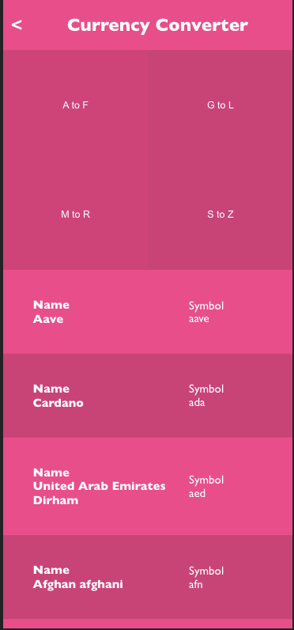

<a name="readme-top"></a>


<div align="center">

  <h1><b>Currency Converter</b></h1>
  

</div>

<!-- TABLE OF CONTENTS -->

# 📗 Table of Contents

- [📗 Table of Contents](#-table-of-contents)
- [📖 Currency Converter](#about-project)
- [📖 Video Description](#vid-desc)
  - [🛠 Built With ](#-built-with)
    - [Tech Stack ](#tech-stack)
    - [Key Features ](#key-features)
  - [🚀 Live Demo ](#-live-demo-)
  - [💻 Getting Started ](#-getting-started)
    - [Prerequisites](#prerequisites)
    - [Setup](#setup)
    - [Install](#install)
    - [Usage](#usage)
    - [Run tests](#run-tests)
    - [Deployment](#deployment)
  - [👥 Authors ](#-authors-)
  - [🔭 Future Features ](#-future-features)
  - [🤝 Contributing ](#-contributing-)
  - [⭐️ Show your support ](#️-show-your-support)
  - [🙏 Acknowledgments ](#-acknowledgments)
  - [📝 License ](#-license)

<!-- PROJECT DESCRIPTION -->

# 📖 Currency Converter<a name="about-project"></a>

The **Currency Converter** is a web application designed for converting any currency to another, the default conversion is from the clicked/tapped currency to the US dollar but you can also convert from any desired currency to another using the form in the details page by entering the symbols for currencies you want to convert.

## Video Description <a name="vid-desc">
[Loom video describing project](https://www.loom.com/share/)

## 🛠 Built With <a name="built-with"></a>

### Tech Stack <a name="tech-stack"></a>


<details>
  <summary>HTML</summary>
  <ul>
    <li>HTML</li>
  </ul>
</details>

<details>
  <summary>CSS</summary>
  <ul>
    <li>CSS</li>
  </ul>
</details>

<details>
  <summary>Javascript</summary>
  <ul>
    <li>Javascript</li>
  </ul>
</details>

<!-- Features -->

### Key Features <a name="key-features"></a>

- Use React documentation.
- Use React components.
- Use React props.
- Use React Router.
- Connect React and Redux.
- Handle events in a React app.
- Write unit tests with React Testing Library.
- Use styles in a React app.
- Use React hooks.
- Apply React best practices and language style guides in code.
- Use store, actions and reducers in React.

<p align="right">(<a href="#readme-top">back to top</a>)</p>

<!-- LIVE DEMO -->

## 🚀 Live Demo <a name="live-demo"></a>

- Here is the [live demo version](https://converter-gop9.onrender.com/).

<p align="right">(<a href="#readme-top">back to top</a>)</p>

<!-- GETTING STARTED -->

## 💻 Getting Started <a name="getting-started"></a>

To get a local copy up and running, follow these steps:

 ```bash
 clone this repository into your machine
 npm install
 npm start
```

### Prerequisites

In order to run this project you need:

- Create a repo on your repositores files.
- Clone or make a copy of this repo on your local machine.
- Follow the install instructions

### Setup

Clone this repository to your desired folder:
 
 ```bash
 cd my-folder
 git clone git@github.com:flemton/currency-converter.git
```

### Install

Install this project with:

 ```bash
 npm install
```

### Usage

To run the project, you can use your favorite browser.


### Run tests

To run tests, execute the following command:

```bash
 npm test
```

### Deployment

- N/A

<p align="right">(<a href="#readme-top">back to top</a>)</p>

<!-- AUTHORS -->

## 👥 Author <a name="authors"></a>

👤 **Alhassan Osman**

- GitHub: [@flemton](https://github.com/flemton)
- Twitter: [@oalhassan847](https://twitter.com/oalhassan847)
- LinkedIn: [Alhassan Osman](https://www.linkedin.com/in/newtongh/)

<p align="right">(<a href="#readme-top">back to top</a>)</p>

<!-- FUTURE FEATURES -->

## 🔭 Future Features <a name="future-features"></a>


- [ ] **Past conversions**
- [ ] **Web socket**


<p align="right">(<a href="#readme-top">back to top</a>)</p>

<!-- CONTRIBUTING -->

## 🤝 Contributing <a name="contributing"></a>

Contributions, issues, and feature requests are welcome!

Feel free to check the [issues page](../../issues/).

<p align="right">(<a href="#readme-top">back to top</a>)</p>

<!-- SUPPORT -->

## ⭐️ Show your support <a name="support"></a>

If you like this project feel free to make any comment, all contributions are welcome!.

<p align="right">(<a href="#readme-top">back to top</a>)</p>

<!-- ACKNOWLEDGEMENTS -->

## 🙏 Acknowledgments <a name="acknowledgements"></a>

I would like to thank the Microverse comunity,[Nelson Sakwa](https://www.behance.net/sakwadesignstudio) for this perfect design, my morning session partners, teammates and standup partners for supporting me.

<p align="right">(<a href="#readme-top">back to top</a>)</p>

## 📝 License <a name="license"></a>

This project is [Creative Commons](https://creativecommons.org/licenses/by-nc/4.0/legalcode) licensed.

<a href="LICENSE.md">

<p align="right">(<a href="#readme-top">back to top</a>)</p>
